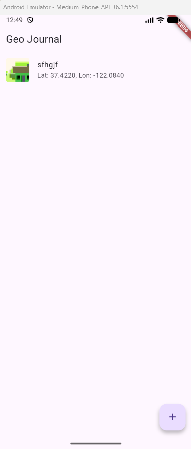
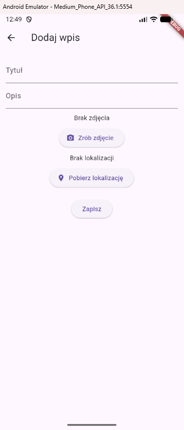

# Geo Journal: Dziennik z Lokalizacją i Zdjęciami

Aplikacja mobilna stworzona w **Flutterze** (Dart), pozwalająca na dodawanie wpisów dziennika z wykorzystaniem **natywnych funkcji urządzenia** (GPS i kamera) oraz komunikacji z **REST API**. Projekt spełnia wszystkie formalne wymagania zadania.

---

## Funkcje aplikacji

### Natywne funkcje

Aplikacja korzysta z dwóch natywnych możliwości urządzenia:

- **Kamera** — wykonanie zdjęcia aparatem i dołączenie do wpisu (użycie wtyczki `camera`).
- **GPS** — pobieranie współrzędnych bieżącej lokalizacji użytkownika (użycie wtyczki `geolocator`).

### Komunikacja z API (MockAPI)

Aplikacja łączy się z API:

- **GET** → pobieranie listy wpisów (`fetchEntries`).
- **POST** → dodawanie nowego wpisu (`addEntry`).

Endpoint:
`https://6935d9d6fa8e704dafbf0fbe.mockapi.io/api/v1/JournalEntry`

---

## Widoki aplikacji

### 1. Lista wpisów — _HomeScreen_

- Pobieranie wpisów z API i wyświetlanie ich w `ListView`.
- **Pełna obsługa stanów UX**: ładowanie, błąd API, pusty stan (_„Brak wpisów”_).
- Wyświetlanie miniatur zdjęć (odczytywane lokalnie: `Image.file`).

### 2. Dodawanie wpisu — _AddEntryScreen_

Umożliwia:

- wpisanie **tytułu** i **opisu**.
- wykonanie zdjęcia kamerą i pobranie lokalizacji GPS.
- zapisanie wpisu do API.

**Walidacja:**

- pola Tytuł/Opis nie mogą być puste – błąd jest sygnalizowany za pomocą **SnackBar**.

### 3. Szczegóły wpisu — _EntryDetailsScreen_

Zawiera:

- zdjęcie (odczytywane lokalnie z weryfikacją istnienia pliku).
- pełny opis wpisu i zapisane współrzędne lokalizacji GPS.
- **Stabilność:** Zaimplementowano asynchroniczne sprawdzanie istnienia pliku, aby uniknąć zawieszeń przy usuniętych plikach tymczasowych.

---

## Wykorzystane technologie

- Flutter / Dart
- HTTP (`http`)
- Kamera (`camera`)
- Lokalizacja (`geolocator`)
- Material Design 3

---

## Uruchamianie i Konfiguracja

1.  Zainstaluj Flutter.

2.  **Skonfiguruj Uprawnienia (Android):**
    Upewnij się, że w pliku `android/app/src/main/AndroidManifest.xml` dodano uprawnienia dla **Aparatu** i **GPS**:

    ```xml
    <uses-permission android:name="android.permission.CAMERA"/>
    <uses-permission android:name="android.permission.ACCESS_FINE_LOCATION" />
    <uses-permission android:name="android.permission.ACCESS_COARSE_LOCATION" />
    <uses-permission android:name="android.permission.FOREGROUND_SERVICE" />
    ```

3.  W katalogu projektu wykonaj:
    ```bash
    flutter pub get
    flutter run
    ```
    _Uwaga: Uruchomienie na urządzeniu fizycznym lub emulatorze z obsługą kamery i GPS jest wymagane._

---

## Zrzuty Ekranu Demonstrujące Działanie






---

## Definition of Done (DoD) - Status

Potwierdzenie spełnienia formalnych wymagań zadania:

- [x] 3–4 widoki, kompletna nawigacja.
- [x] Co najmniej 1 natywna funkcja (Aparat i GPS).
- [x] Co najmniej 1 operacja API (GET i POST).
- [x] Stany: ładowanie, błąd, pusty.
- [x] `README.md` (Ten plik)
- [x] Zrzuty ekranów.
- [x] Min. 3 commity.
